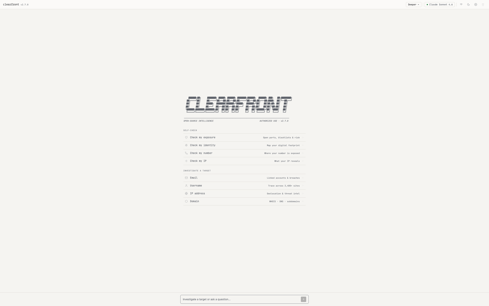
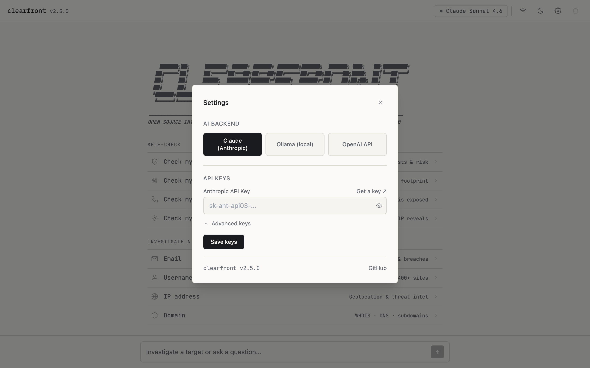

<div align="center">
  <h1>Clearfront</h1>
  <p><strong>Open-source AI intelligence on your digital footprint.</strong></p>
  <p>Give Clearfront an email, username, domain, IP, or name, and its AI security analyst scans public data sources in one sweep, then returns a calibrated report and an interactive evidence graph. Check your own exposure, or investigate an authorized target. It runs locally with your own API keys and sends nothing to us.</p>
  <p>Interactive REPL · CLI · local web console · MCP server. Powered by Anthropic Claude, a local Ollama model, or any OpenAI-compatible endpoint.</p>
</div>

<div align="center">

[](https://www.python.org/)
[](LICENSE)
[](https://modelcontextprotocol.io/)
[](CHANGELOG.md)

**[clearfront.sh](https://clearfront.sh)** · [Disclaimer](./DISCLAIMER.md)

</div>

- **30 modular tools**, email, username (sherlock + WhatsMyName), broad username discovery across 3,000+ sites (maigret), search-based footprint discovery, IP, IP self-exposure report, domain, WHOIS, breach, Gravatar profile, EmailRep reputation, phone, paste, EXIF/GPS metadata, Shodan, VirusTotal, Censys, IP2Location, AbuseIPDB, GitHub (profile + public code/secret exposure), DNS, subdomain discovery via certificate transparency (crt.sh), historical URL recovery via the Wayback Machine (Internet Archive), mass-scan visibility (GreyNoise Community), infostealer-exposure check (Hudson Rock, free tier, no plaintext credentials), dork generation, live dork search, URL scraping, BTC/ETH address lookup, and passive domain recon (theHarvester)
- **MCP server built in**, expose all 30 tools natively to Claude Code, Claude Desktop, and any MCP-compatible client
- **Three AI backends**, Anthropic Claude (default), local Ollama, or any OpenAI-compatible endpoint; tool results come from real subprocess calls, never hallucinated
- **Fully async**, parallel tool execution via `asyncio.gather()` with hard subprocess timeouts
- **MIT licensed**, no embedded LLM; bring your own API key or run fully offline

---

> **Legal Disclaimer**: Clearfront is intended for **legal and authorized use only**.
> Users are solely responsible for ensuring their use complies with all applicable laws and regulations.
> The authors accept no liability for misuse. See [DISCLAIMER.md](DISCLAIMER.md).

## What is Clearfront?

Clearfront is an AI agent for Open Source Intelligence with three interfaces: an interactive terminal REPL, a direct CLI, and an MCP server exposable to Claude Code, Claude Desktop, or any MCP-compatible client, plus a browser-based Web UI. The AI layer uses Anthropic's native tool use API (or a local Ollama model, or any OpenAI-compatible endpoint): the model issues hard stops when it needs a tool, your code executes the real binary, the actual output goes back, hallucination in tool results is structurally impossible.

## Installation

```bash
git clone https://github.com/scottmartinanderson/clearfront
cd clearfront
pip install -e .
```

**External binaries** (must be in `PATH`):

| Binary | Purpose | Install |
|--------|---------|---------|
| `holehe` | Email account enumeration | `pip install holehe` |
| `sherlock` | Username enumeration (300+ platforms) | `pip install sherlock-project` |
| `sublist3r` | Subdomain enumeration | `pip install sublist3r` |
| `phoneinfoga` | Phone number intelligence | [Download binary](https://github.com/sundowndev/phoneinfoga/releases) |
| `theHarvester` | Passive domain recon (emails/subdomains) | `pip install git+https://github.com/laramies/theHarvester.git` |

If a binary is absent, the corresponding tool returns a descriptive error string. All other tools remain operational.

## Quick Start

```bash
# Interactive AI REPL (default)
clearfront

# Web interface
clearfront web

# Direct tool (no AI)
clearfront email target@example.com
```

## Configuration

Store all keys in a `.env` file at the project root (copy `.env.example`). `python-dotenv` loads it automatically at startup.

| Variable | Tool | Required | Purpose |
|----------|------|----------|---------|
| `ANTHROPIC_API_KEY` | AI agent | Yes (or use Ollama / OpenAI) | Anthropic API key |
| `OPENAI_BASE_URL` | AI agent | Optional | Base URL of an OpenAI-compatible endpoint (e.g. `http://localhost:4000/v1`). When set and `ANTHROPIC_API_KEY` is absent, it is used as the AI backend (takes precedence over Ollama). The model must support tool/function calling. |
| `OPENAI_API_KEY` | AI agent | Optional | API key for the OpenAI-compatible endpoint (local servers may ignore it) |
| `OPENAI_MODEL` | AI agent | Optional | Model name to request from the endpoint (default: `gpt-4o-mini`) |
| `HIBP_API_KEY` | `search_breach` | Optional | HaveIBeenPwned v3, [get one](https://haveibeenpwned.com/API/Key) |
| `IPINFO_TOKEN` | `search_ip` | Optional | ipinfo.io higher rate limits |
| `SHODAN_API_KEY` | `search_shodan` | Optional | Shodan API, [get one](https://account.shodan.io) |
| `VIRUSTOTAL_API_KEY` | `search_virustotal` | Optional | VirusTotal API v3, [get one](https://www.virustotal.com/gui/my-apikey) |
| `IP2LOCATION_API_KEY` | `search_ip2location` | Optional | IP2Location.io enhanced IP intelligence, [get one](https://www.ip2location.io/pricing) |
| `CENSYS_PAT` + `CENSYS_ORG_ID` | `search_censys` | Optional | Censys Platform API: Personal Access Token + Organization ID, [get one](https://platform.censys.io) |
| `ABUSEIPDB_API_KEY` | `search_abuseipdb` | Optional | AbuseIPDB v2, [get one](https://www.abuseipdb.com/account/api) |
| `GITHUB_TOKEN` | `search_github` | Optional | GitHub API, raises rate limit from 60 to 5000 req/h, [get one](https://github.com/settings/tokens) |
| `SERPER_API_KEY` | `search_dorks_live`, `search_footprint` | Optional | Serper.dev Google SERP API, the preferred SERP backend (~$1/1k, 2,500 free), [get one](https://serper.dev). |
| `BRIGHTDATA_API_KEY` | `search_dorks_live`, `scrape_url` | Optional | Bright Data API key, [get one](https://get.brightdata.com/8ygvxztgo5dr) (free tier: 5,000 req/month). |
| `BRIGHTDATA_SERP_ZONE` | `search_dorks_live` | Optional | Your Bright Data SERP API zone name (e.g. `serp_api1`). |
| `BRIGHTDATA_UNLOCKER_ZONE` | `scrape_url` | Optional | Your Bright Data Web Unlocker zone name (e.g. `web_unlocker1`). |

The Bright Data link above is a referral link; signing up through it supports Clearfront at no extra cost to you.

**Optional Python packages:**

| Package | Purpose | Install |
|---------|---------|---------|
| `ollama` | Local LLM backend (no API key) | `pip install ollama` *(also install the [Ollama runtime](https://ollama.com))* |
| `openai` | OpenAI-compatible backend for the REPL/CLI (`--provider openai`) | `pip install "clearfront[openai]"` |
| `shodan` | Shodan API client | `pip install shodan` |
| `reportlab` | PDF report export | `pip install reportlab` |
| `censys` | Censys API client | `pip install censys` |

## Tools

| Tool | Powered by | What it investigates |
|------|-----------|---------------------|
| `search_email` | holehe | Social accounts linked to an email address |
| `search_username` | sherlock | Username presence across 300+ platforms |
| `search_breach` | HaveIBeenPwned v3 API | Data breach exposure |
| `search_whois` | python-whois | Domain registrant and DNS info |
| `search_ip` | ipinfo.io | Geolocation, ASN, hostname |
| `search_domain` | sublist3r | Subdomain enumeration |
| `search_crt` | crt.sh | Subdomains from certificate transparency (keyless, passive) |
| `search_wayback` | Internet Archive | Historical/deleted URLs archived under a domain (keyless, passive) |
| `search_greynoise` | GreyNoise Community | Mass-scanner noise vs. targeted actor for an IP (free, 50/week) |
| `generate_dorks` | built-in | 12 targeted Google dork URLs (no network calls) |
| `search_paste` | psbdmp.ws | Pastebin dump mentions |
| `search_phone` | phoneinfoga | Carrier, country, line type |
| `search_shodan` | Shodan API | Open ports, banners, CVEs |
| `search_virustotal` | VirusTotal API v3 | Verdict from 70+ antivirus engines |
| `search_ip2location` | IP2Location.io API | Enhanced IP intel: VPN/Proxy/Tor/datacenter flags |
| `search_censys` | Censys Search API | Internet-facing infrastructure, certificates |
| `search_abuseipdb` | AbuseIPDB v2 API | IP abuse reputation: confidence score, reports, country, ISP |
| `search_github` | GitHub REST API | Profile, repos, commit-discovered emails, username/keyword search |
| `search_dns` | dnspython (built-in) | A/AAAA/MX/NS/TXT/CNAME/SOA records; SPF, DMARC, DKIM analysis |
| `search_dorks_live` | Bright Data SERP API | Live Google search results for dork queries (title, URL, snippet) |
| `scrape_url` | Bright Data Web Unlocker | Fetch any URL bypassing Cloudflare/CAPTCHA, returns clean Markdown |
| `search_maigret` | maigret | Username presence across 3,000+ sites |
| `search_footprint` | SERP (Serper / Bright Data / DuckDuckGo) | Search-based footprint discovery for a name or handle |
| `search_gravatar` | Gravatar API | Public Gravatar profile for an email: avatar, display name, linked accounts |
| `search_emailrep` | EmailRep.io | Email reputation and footprint summary |
| `search_hudsonrock` | Hudson Rock Cavalier (free) | Infostealer-exposure check for an email or username (no plaintext credentials) |
| `search_exif` | exiftool | EXIF / IPTC / XMP metadata and embedded GPS from a local file |
| `search_crypto` | public chain APIs | Bitcoin / Ethereum address summary: balance, transaction count |
| `search_harvester` | theHarvester | Passive domain recon: emails, subdomains, hosts |
| `search_exposure` | built-in (composite) | Self-exposure report for an IP across the infrastructure tools |

## Interfaces

### Interactive REPL

Run `clearfront` with no arguments to start the AI-powered REPL. Type a target (email, username, domain, IP, name) or a question; the agent decides which tools to run, chains them on findings, and compiles a report.

**REPL commands:** `<target>`, `clear`, `save`, `tools`, `config`, `history`, `help`, `exit` / Ctrl-D.

All sessions are auto-saved to `~/.clearfront/history/`. Browse with `clearfront history`.

### Web UI

```bash
pip install "clearfront[web]"
clearfront web
# Opens http://localhost:8080 automatically
```

Browser-based AI chat with streaming tool output, inline result cards, and a light/dark theme toggle. Supports fully local inference via Ollama or any OpenAI-compatible endpoint (no Anthropic API key required when using a local backend).

<table>
  <tr>
    <td width="50%"></td>
    <td width="50%"></td>
  </tr>
</table>

The console runs entirely on your machine and binds to `127.0.0.1` by default. Choose your backend and paste your own key in Settings; your keys and the targets you investigate never touch our servers. More screenshots are in [`media/screenshots/`](media/screenshots/).

### MCP Server

Expose all 30 tools to any MCP-compatible AI client.

**Claude Code:**

```bash
claude mcp add clearfront python /absolute/path/to/clearfront/mcp_server.py
claude mcp list
```

**Claude Desktop**, add to `~/Library/Application Support/Claude/claude_desktop_config.json`:

```json
{
  "mcpServers": {
    "clearfront": {
      "command": "python",
      "args": ["/absolute/path/to/clearfront/mcp_server.py"]
    }
  }
}
```

## Docker

```bash
docker compose up --build
docker compose run --rm clearfront email target@example.com --json
```

Set `ANTHROPIC_API_KEY` (and optionally `HIBP_API_KEY`, `IPINFO_TOKEN`) in a `.env` file or export them before running. Reports persist to `./reports/` via a volume mount.

## CLI Reference

| Flag / Subcommand | Description |
|---|---|
| `clearfront` | Interactive AI REPL (default) |
| `clearfront web [--port N] [--no-browser]` | Launch browser UI |
| `clearfront email ADDRESS [-t N]` | Direct email scan |
| `clearfront username HANDLE [-t N]` | Direct username scan |
| `clearfront shodan QUERY [-t N]` | Shodan lookup |
| `clearfront virustotal TARGET [-t N]` | VirusTotal lookup |
| `clearfront censys TARGET [-t N]` | Censys lookup |
| `clearfront ip2location IP [-t N]` | IP2Location lookup |
| `clearfront abuseipdb IP [-t N]` | AbuseIPDB reputation check |
| `clearfront github QUERY [-t N]` | GitHub profile/repo/email discovery |
| `clearfront dns DOMAIN [-t N]` | DNS records + email security analysis |
| `clearfront multi TARGETS` | Parallel multi-target investigation (max 10) |
| `clearfront graph TARGET [-o PATH] [--format graphml\|json\|mermaid\|all]` | Auto-pivot and export the entity correlation graph (GraphML/JSON/Mermaid) |
| `clearfront history [--all] [open N] [clear]` | View/manage REPL session history |
| `-v, --verbose` | Enable debug logging to stderr |
| `-t, --timeout N` | Override subprocess timeout (seconds) |
| `--api-key KEY` | Anthropic API key (overrides env var) |
| `--parallel` | Run complementary tools concurrently |
| `--json` | Output results as structured JSON |
| `-o, --output FILE` | Write results to FILE instead of stdout (raw; combine with `--json` for a JSON file) |
| `--provider {anthropic,ollama,openai}` | AI provider (default: `anthropic`) |
| `--ollama-model MODEL` | Ollama model name (default: `llama3.2`) |
| `--ollama-host URL` | Ollama server URL (default: `http://localhost:11434`) |
| `--openai-base-url URL` | OpenAI-compatible endpoint base URL (env: `OPENAI_BASE_URL`) |
| `--openai-model MODEL` | Model to request from the endpoint (env: `OPENAI_MODEL`) |
| `--openai-api-key KEY` | API key for the endpoint (env: `OPENAI_API_KEY`) |
| `--no-pdf` | Disable automatic PDF generation |

## Contributing

Issues and pull requests are welcome. See [CONTRIBUTING.md](CONTRIBUTING.md) for the development workflow and coding conventions. Please read [DISCLAIMER.md](DISCLAIMER.md) before contributing.

## License

Clearfront is open source under the [MIT License](./LICENSE).

The bundled username dataset `clearfront/tools/data/wmn-data-unique.json` is a filtered
adaptation of the [WhatsMyName](https://github.com/WebBreacher/WhatsMyName) project
by Micah Hoffman, used under the [CC BY-SA 4.0](https://creativecommons.org/licenses/by-sa/4.0/)
license; that file (and adaptations of it) remains under CC BY-SA 4.0. See
[`clearfront/tools/data/NOTICE`](./clearfront/tools/data/NOTICE).

---

*For authorized security research only. See [DISCLAIMER.md](DISCLAIMER.md).*
